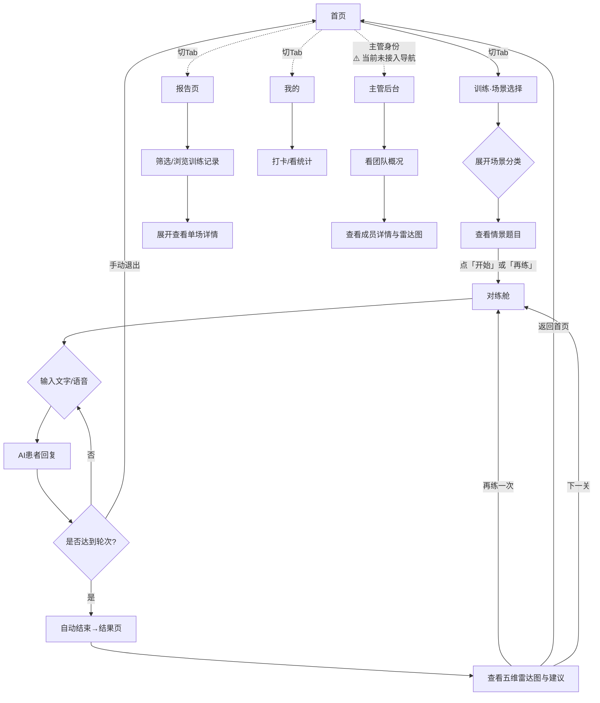

# 口腔医疗客服智能陪练系统 · 技术说明文档（前端聚焦版）

> 文档状态：v1.0 前端聚焦版 ｜ 适用人员：前端开发 / 产品 / 设计
> 配套文档：`docs/api.md`（接口契约）
> 阅读建议：本文档聚焦前端各模块的**功能、用户操作、输入输出**，技术实现细节与待办事项统一收纳在第六章。

---

## 一、文档说明与阅读指引

### 1.1 关于本文档

这是一份**面向前端开发者与产品设计人员**的技术说明文档。文档仅从**用户视角**描述每个页面的：

- **做什么**（功能说明）
- **怎么用**（用户操作步骤）
- **输入什么 / 输出什么**（页面数据流）

所有后端接口、算法逻辑、性能指标等技术实现细节，统一放在 **第六章「待实现与技术细节」**，正文不展开。

### 1.2 核心术语

本文档全程使用项目统一术语，对照如下：

| 术语 | 含义 |
|------|------|
| 场景分类 | 四大沟通场景：咨询解答、价格异议、投诉安抚、项目推荐。每个分类下包含多个训练题目。 |
| 情景题目 | 场景分类下的具体训练项，例如「种植牙咨询」「9.9 洗牙券升单」等。学员选中后进入对练。 |
| 对练舱 | 模拟微信私聊界面的对话训练页面，学员在此与 AI 患者进行语音/文字对练。 |
| 五维评分 | 训练结束后对学员表现的五个维度评价：同理心与温度、需求挖掘力、价值塑造力、邀约转化、合规意识。 |
| 通关 | 单场对练综合分 ≥ 60 分视为过关（`passed = true`）。 |
| 黄金话术 | 系统针对学员待改进的回复，给出的推荐标准话术示例。 |

### 1.3 页面路径一览

| 页面 | 路径 | 入口 |
|------|------|------|
| 首页 | `pages/home/home` | 底部 Tab「首页」 |
| 训练 · 场景选择 | `pages/index/index` | 底部 Tab「训练」 |
| 对练舱 | `pages/training/training` | 从场景选择点「开始/再练」进入 |
| 结果页 | `pages/result/result` | 对练结束后自动跳转 |
| 训练报告 | `pages/report/report` | 底部 Tab「报告」 |
| 我的 | `pages/mine/mine` | 底部 Tab「我的」 |
| 主管后台 | `pages/admin/admin` | 页面代码已实现，但当前未挂任何导航入口，无法访问 |

---

## 二、产品概述

### 2.1 一句话定位

为口腔诊所客服人员提供一个**模拟真实微信对话的 AI 陪练小程序**，让学员在零压力环境下反复练习话术，并获得多维度评分与改进建议。

### 2.2 目标用户

- **学员客服**：口腔诊所的新晋或一线客服/咨询师，需要通过练习提升话术与沟通转化能力。
- **客服主管**：负责带教与质检的管理者，需要查看团队训练数据与能力分布。

### 2.3 核心价值

- **低门槛反复练**：打开小程序即可开始，无需真人配合。
- **即时反馈**：每次对练结束后，立刻看到五维雷达图评分与具体改进建议。
- **数据驱动管理**：主管可查看团队训练概览与每位成员的能力画像。

---

## 三、用户角色与典型场景

### 3.1 用户角色

| 角色 | 画像 | 核心诉求 | 权限 |
|------|------|----------|------|
| 学员客服 | 25–35 岁，话术不熟、易紧张 | 随时练习、看到评分与改进建议 | 训练、查看个人报告、打卡 |
| 客服主管 | 负责带教与质检 | 查看团队训练情况与能力分布 | 全部学员权限 + 主管后台 |

### 3.2 典型场景

**场景 A：午休自主练习「价格异议」话术**

> 新客服小王午休时打开小程序 → 在「训练」页看到 4 个场景分类 → 展开「价格异议」→ 看到「种植牙·价格抗拒」情景题目 → 点「开始」进入对练舱 → 与 AI 患者文字对话 → 5 轮后结束 → 跳到结果页查看雷达图，发现「邀约转化」偏弱 → 阅读系统给出的改进建议 → 点「再练一次」巩固。

**场景 B：主管查看团队训练情况**

> 主管打开小程序切到「管理」tab → 看到团队概览（总人数、平均分、通关率）→ 查看成员列表，找到上周新人小李 → 点进去查看雷达图，发现「需求挖掘力」薄弱 → 安排针对性辅导。

---

## 四、前端功能模块

---

### 4.1 首页（`pages/home`）

- **功能说明**：展示热门话术卡片，供学员快速浏览常见场景的标准对话示范，并提供「搜索」和「场景分类」入口。

- **用户如何使用**：
  1. 打开小程序默认进入首页，看到顶部轮播的「热门话术」卡片。
  2. 点击话术卡片可展开查看完整的**标准对话示范**（患者在说什么、客服该怎么回）。
  3. 卡片上有「去训练」按钮，点击跳转到「训练」tab。
  4. 上方搜索框点击后提示「搜索功能待开放」（当前未接入）。
  5. 下方三个场景入口卡片（咨询解答 / 价格异议 / 投诉安抚），点击后提示「功能开发中」（当前未接入）。

- **输入**：无用户输入（纯展示页）。
- **输出**：热门话术卡片列表（轮播形式），每个卡片包含话术标题与示范对话；底部导航栏切换至其他页面。

---

### 4.2 训练 · 场景选择中心（`pages/index`）

- **功能说明**：按「4 大场景分类」组织全部训练题目。学员展开场景分类后选择具体情景题目，即可开始对练。这是进入对练舱的入口页（底部 Tab「训练」）。

- **用户如何使用**：
  1. 切到底部「训练」Tab，顶部展示用户卡（头像 / 昵称 / Lv.等级 · 积分），未登录时显示默认欢迎卡。
  2. 页面主体展示 **4 张场景分类卡**（可折叠）：
     - 咨询解答
     - 价格异议
     - 投诉安抚
     - 项目推荐
  3. 每张分类卡上显示该类别的**完成进度**（如「已练 1/4」）。
  4. 点击任意分类卡**展开**，看到该分类下的「情景题目」列表。
  5. 每个情景题目显示：**题目名称**、**难度**（初级 / 中级 / 高级）、**情景描述**（简单场景介绍）、**及格分**。
  6. 如果已经练过该题目，额外显示**历史最佳分**，按钮文案变为「再练」；未练过则按钮为「开始」。
  7. 点击「开始」或「再练」→ 携带该题的 `levelId` 跳转到对练舱页面。

- **输入**：用户展开的场景分类、点击的具体情景题目。
- **输出**：4 个场景分类及其下属情景题目列表；点击后跳转至对练舱（传递 `levelId`）。

---

### 4.3 对练舱（`pages/training`）

- **功能说明**：模拟微信私聊界面，学员在此与 AI 患者进行一对一文字对话训练。顶部显示患者信息与剩余轮次，底部提供文字输入与语音按钮（语音功能当前待实现）。

- **用户如何使用**：
  1. 从场景选择进入后，顶部显示患者头像、昵称（如「咨询中的李女士」）和剩余轮次。
  2. 中间是聊天区域：AI 患者消息居左（白底气泡），学员消息居右（绿底气泡），与真实微信布局一致。
  3. 在底部输入框打字，点「发送」按钮发送消息。
  4. AI 患者会回复（居左气泡），期间显示「对方正在输入…」状态。
  5. 消息气泡下方有「黄金话术」区域（可点击展开/收起，展示系统推荐的标准回复——当前待实现）。
  6. 底部输入栏左侧有**语音按钮**（点击/按住说话的交互——当前待实现）。
  7. 对话达到预设轮次后**自动结束**，弹出训练结果并跳转结果页。
  8. 顶部「退出」按钮可随时退出对练。

- **输入**：
  - 上级页面传入的 `levelId`（标识选择的情景题目）。
  - 用户每轮输入的文字内容。

- **输出**：
  - 完整的对话记录（学员消息 + AI 患者回复）。
  - 训练结束后携带分数跳转结果页（当前为本地模拟分）。

---

### 4.4 结果页（`pages/result`）

- **功能说明**：训练结束后的评价报告页，用雷达图展示学员在五大维度的得分，给出总评与改进建议。

- **用户如何使用**：
  1. 对练结束后自动跳入本页，顶部看到**总分**和**通过/未通过**结果。
  2. 中间是**五维雷达图**，五个顶点分别为：
     - 同理心与温度
     - 需求挖掘力
     - 价值塑造力
     - 邀约转化
     - 合规意识
  3. 雷达图下方是**维度得分明细列表**，每个维度显示具体得分和简短评语。
  4. 再往下是 **AI 综合建议**，指出本次训练的优势和待提升方向。
  5. 底部操作区提供：
     - 「再练一次」→ 返回对练舱，重新训练本题
     - 「返回首页」→ 回到首页
     - 「下一关」→ 进入同分类下一个情景题目（如有）

- **输入**：从对练舱页传入的训练数据（当前为 URL 参数携带分数）。
- **输出**：五维雷达图、总分、通过结果、维度明细、AI 建议；操作按钮跳转。

---

### 4.5 训练报告（`pages/report`）

- **功能说明**：学员的历史训练记录总览，支持按通过状态和场景分类筛选，点击单条记录可展开查看该场训练的完整雷达图与建议。

- **用户如何使用**：
  1. 切到底部「报告」Tab，看到所有历史训练记录列表。
  2. 顶部筛选栏：可切换「全部 / 已通过 / 未通过」，以及按场景分类筛选（咨询解答 / 价格异议 / 投诉安抚 / 项目推荐）。
  3. 每条记录显示：场景名（如「种植牙咨询」）、得分、通过/未通过标签、训练时间。
  4. 点击任意记录**展开**详情：显示该场训练的雷达图、各维度得分明细、AI 建议。
  5. 再次点击或点击其他记录可收起或切换。

- **输入**：用户的筛选条件（通过状态 + 场景分类）。
- **输出**：筛选后的训练记录列表；展开单条记录时显示该场的五维雷达图与改进建议。

---

### 4.6 我的（`pages/mine`）

- **功能说明**：学员的个人中心，展示用户信息、打卡日历与训练统计，支持每日打卡。

- **用户如何使用**：
  1. 切到底部「我的」Tab，顶部展示用户信息：头像、昵称、当前积分、等级（如 Lv.3）。
  2. 下方是**打卡日历**，按月展示（7 天一行），今天高亮，已打卡日期显示打勾图标。
  3. 点击当天日期（未打卡状态下）→ 执行打卡 → 当日变为已打卡状态 → 获得积分奖励。
  4. 日历下方展示**训练统计**：
     - 累计训练次数
     - 训练通过率
     - 平均得分
     - 累计打卡天数

- **输入**：用户点击打卡操作。
- **输出**：用户信息卡片、打卡日历（更新后的打卡状态）、四项训练统计数据。

---

### 4.7 主管后台（`pages/admin`）⚠️ 未上线

> **当前状态**：页面代码（`admin.js / .wxml / .wxss / .json`）已编写完成，并在 `app.json` 中注册了路由。但存在以下问题导致**无法正常使用**：
> - 底部 `tabBar` 未包含「管理」入口，全项目无任何 `navigateTo` 跳转至此页。
> - 没有角色判断逻辑（`app.js` 的 `userInfo` 无 `role` 字段），无法区分主管与学员。
> - 后端接口 `/admin/dashboard` 未在文档中记录契约。
>
> 以下为代码中**已实现**的功能（与 PRD 规划存在差异）：

- **功能说明**：当前已实现团队概览数据展示、训练趋势图、团队排名 TOP5、高频违规词统计、关卡通过率及导出报表功能。

- **已实现内容**：
  1. 顶部**团队概览**四个指标卡片：
     - 总学员数
     - 总训练次数
     - 团队平均分
     - 活跃人数（非 PRD 规划的「团队通关率」）
  2. 训练趋势 Canvas 折线图。
  3. 团队排行榜 TOP5（非完整成员列表）。
  4. 高频违规词统计。
  5. 关卡通过率展示。
  6. 导出报表功能（`onExport`）。

- **与 PRD 规划的差异**：
  - 规划「团队通关率」→ 实际实现「活跃人数」。
  - 规划「成员列表 + 点击查看五维雷达图」→ 实际仅实现「团队排名 TOP5」，`viewMemberDetail` 只是跳转到报告页，无成员下钻雷达图。

- **待实现**（如需上线）：
  - 在 `app.json` 的 `tabBar` 中添加「管理」Tab，并实现角色判断逻辑（仅主管可见）。
  - 补充 `/admin/dashboard` 接口契约，对接真实后端数据。
  - 按 PRD 规划补充「团队通关率」「成员列表」「成员五维雷达图下钻」功能。

---

## 五、核心用户流程

---

## 六、待实现与技术细节

> 以下内容从原技术说明文档中整理收纳，供研发评估与后续实现参考。正文（一至五章）不再展开这些细节。

---

### 6.1 模拟数据 → 真实接口对接

当前所有页面均使用**本地写死数据**，尚未对接后端接口。需逐一接入（详见 `docs/api.md`）：

| 页面 | 当前状态 | 待对接 |
|------|----------|--------|
| 首页 `home` | 热门话术卡片为本地 mock | 待提供话术接口 |
| 训练 `index` | 场景分类与情景题目为本地 mock | 待提供场景/题目列表接口 |
| 对练舱 `training` | 对话逻辑全写死，`getLevelConfig` 本地映射 | 需接入 `/training/start` → `/training/message` → `/training/end` |
| 结果页 `result` | 分数从对练舱 URL 传入随机数据，`onLoad` 却读 `conversationId` 调接口——**两者对不上** | 统一为 `conversationId` 模式，接入 `/result/{id}` |
| 报告 `report` | 训练记录为本地 mock | 接入训练记录列表接口 |
| 我的 `mine` | 用户信息 mock，打卡仅存本地 storage | 接入 `/login`、`/checkin`、统计接口 |
| 主管后台 `admin` | 页面代码已实现，但无导航入口、未上线（功能与 PRD 规划存在差异，详见 4.7） | 接入导航 + 角色权限 + 对接 `/admin/dashboard` 接口 |

### 6.2 `training.getLevelConfig` 的 levelId 错配

当前代码中 `index.js` 传入的 `levelId` 为 `101/201/301/401`，但 `training.js` 的 `getLevelConfig` 函数用键 `1/2/3/4` 查找，导致**患者人格与题目不匹配**（如选择「价格异议」情景却匹配到「咨询解答」的患者）。需修复映射关系。

### 6.3 ASR 语音输入

`training.wxml` 底部已预留语音按钮，但 `startVoiceInput` 函数未实现。

待实现的交互流：

| 行为 | 逻辑 |
|------|------|
| 按住说话 | `touchstart` → 开始录音，按钮态变「松开结束」 |
| 松开发送 | `touchend` → 停止录音 → ASR 转文字 → 文字入输入框/发送 |
| 上滑取消 | `touchmove` 向上位移 > 50px →「取消态」，松手不发送，提示「已取消」 |
| 55 秒震动提醒 | 录音达 55s → 震动一次 |
| 60 秒硬上限 | 自动停止并发送 |

需覆盖的异常：

| 异常 | 处理 |
|------|------|
| 录音 < 1s | Toast「说话时间太短」，不发送 |
| 拒绝麦克风权限 | 引导 `wx.openSetting()` 手动开启；文字输入不受影响 |
| ASR 转写失败 | Toast「识别失败，可重试或改用文字」 |
| 切后台/来电 | `onHide` 暂停录音并取消本次录音 |

### 6.4 黄金话术推荐栏

`training.wxml` 中有可展开/收起的黄金话术区域，但 `showSuggestions` / `toggleSuggestions` / `useGoldenPhrase` 三个函数在 `training.js` 中未定义，当前不显示任何内容。需实现：

- 每条 AI 回复气泡下方展示对应的「黄金话术」建议。
- 支持点击展开/收起。
- 支持一键复制到输入框。

### 6.5 评分与结果链路对齐

当前链路存在问题：

- `training.js` 的 `endTraining` 函数使用**随机分数**，通过 `redirectTo` 拼入 URL（`result?score=...`）。
- `result.js` 的 `onLoad` 读取 `options.conversationId` 并尝试调 `GET /result/{id}` 拉取数据。
- **两者不匹配**——结果页拿不到真实数据。

待对齐方案：对练舱结束后携带 `conversationId` 跳转结果页，结果页通过此 ID 拉取完整的评分数据（五维得分 + 建议 + 高光/待改进话术）。

### 6.6 评分维度与通关阈值

当前项目使用的是**五维**评分体系：

| 维度 | 含义 |
|------|------|
| 同理心与温度 | 是否先理解患者情绪再给信息 |
| 需求挖掘力 | 是否通过提问深入了解患者需求 |
| 价值塑造力 | 是否有效传递治疗方案/产品的价值 |
| 邀约转化 | 是否主动引导到店/留资 |
| 合规意识 | 是否避免绝对化承诺、使用规范表述 |

通关阈值：综合分 ≥ 60 分视为通过（`passed = true`）。

是否调整维度或阈值，待产品确认。

### 6.7 用户登录与打卡持久化

当前实现：

- 登录为本地 mock，无真实身份校验。
- 打卡数据仅存于 `wx.setStorageSync`，卸载小程序后丢失。

待实现：
- 接入微信登录 → 后端 `/login` 接口。
- 打卡数据入库，支持跨设备/跨安装恢复。

### 6.8 性能、适配与安全（待实施）

| 类别 | 事项 | 说明 |
|------|------|------|
| 适配 | 底部安全区 | 对练舱/我的等输入栏使用 `env(safe-area-inset-bottom)` |
| 适配 | 录音权限 | iOS 需 `info.plist` 配置 `NSMicrophoneUsageDescription`；Android 运行时申请 `scope.record` |
| 安全 | 传输加密 | 全程 HTTPS + `Authorization: Bearer` token |
| 安全 | 语音文件 | ASR 完成后删除本地临时文件；服务端 ≤24h 销毁 |
| 安全 | 内容安全 | 用户输入需接微信 `msgSecCheck` 或后端敏感词过滤 |
| 性能 | ASR 转写 | 目标 P95 ≤ 2.5s |
| 性能 | AI 消息响应 | 目标 P95 ≤ 3s（含最小 1.5s「正在输入」展示） |
| 异常 | 断网恢复 | 本地缓存 `conversationId` + 已发消息；恢复后 `onShow` 续接 |
| 异常 | 评分失败 | 仍进结果页，拉不到数据则展示「评分生成中，稍后查看」 |
| 异常 | 评分超时（>8s） | 后端降级返回预设兜底话术 |

---

> **文档结束** ｜ 如有新增模块或需求变更，请同步更新本文档及其版本记录。
