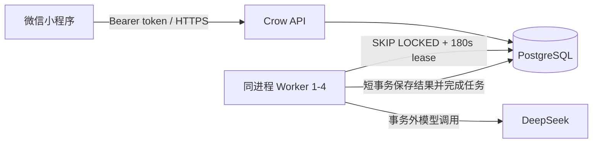

# 后端可靠性与生产架构

## 当前实现

同一个 Windows x64 程序运行 Crow API 和 1—4 个可靠 Worker 线程。API、Worker 与 DeepSeek 网关共享进程，但任务事实状态全部保存于 PostgreSQL，进程退出不会丢失待生成报告。

DeepSeek 请求 URL、请求参数、Prompt、解析、响应归一化和调用内部的 JSON 重试保持既有兼容行为。

## 消息可靠性

每个输入行保存 `reply_status`、`reply_lease_until`、`reply_attempt_token`。会话行先以 `FOR UPDATE` 串行化，再处理幂等 ID：

1. 相同 ID、不同清理后内容：`IDEMPOTENCY_CONFLICT`。
2. 已有完整消息对：返回原结果。
3. 有效租约：返回对应 `RESPONSE_PENDING`。
4. 失败或租约过期：原 ID 领取新令牌。
5. 保存模型回复时同时校验令牌；最后一轮在一个事务里完成消息、会话、报告状态与任务入队。

数据库唯一索引 `(session_id, role, round)` 是最终并发防线。

## 报告任务

`ai_jobs` 使用业务去重键，`ai_job_attempts` 按 `generation + attempt_number` 保留完整审计。人工重试开启新 generation，不覆盖旧尝试。

- 领取：`FOR UPDATE SKIP LOCKED`。
- 租约：180 秒；保存结果时校验 generation、attempt 和未过期租约。
- 自动尝试：最多 3 次，退避 5 秒、30 秒。
- 立即失败：模型未配置、鉴权失败、内容过滤或不安全输出。
- 可重试：超时、限流、模型服务错误、无效 JSON、评分不一致等。
- 重启：过期租约重新领取；最后一次租约过期进入 dead 并同步业务失败状态。
- 数据库中断：Worker 捕获异常并以最高 30 秒退避，异常不离开线程。

模型网络调用不持有数据库事务；写报告、业务 ready 与任务 succeeded 在同一个短事务提交。

## 身份与权限

小程序调用 `wx.login`，后端使用 `jscode2session` 获取 `openid`，然后签发随机 bearer token，只在数据库保存 SHA-256。所有业务查询从 token 获得用户，不接受客户端用户 ID。

- `learner`：本人会话、历史、报告和个人看板。
- `admin`：单机构汇总，无个人最近会话和训练写权限。
- `demo` 模式：相同登录路径签发保留演示用户的 token，便于本机验收。

## 迁移与发布

发布顺序：备份 → 测试库迁移演练 → 停服 → `001` 至 `004` 顺序迁移 → 部署新程序 → 健康检查 → 无模型烟测 → 一次受控真实模型烟测。

`003_reliability.sql` 会把待删除的历史重复行完整保存到 `message_repair_archive`，客服/患者模拟分别保留最早输入和最新回复；然后添加唯一索引、回复租约和任务表。已有 generating 报告/复盘只补任务，不在迁移阶段调用模型。

`004_identity.sql` 先导入所有历史 user ID，再添加外键；既有演示记录不删除。

`005_learner_insights.sql` 新增错题掌握状态表；推荐话术和错题来源仍保留在评分报告 JSON 中，因此不会复制或删除历史训练内容。

## 生产边界

生产必须在 HTTPS 反向代理后运行并启用：`PRODUCTION=true`、`AUTH_MODE=wechat`、精确 `ALLOWED_ORIGIN`、`REQUIRE_HTTPS=true`、`ALLOW_RUNTIME_API_KEY=false`。程序添加请求 ID、JSON 结构日志、用户/IP 滑动窗口限流和健康任务计数。运维应对 `deadJobs > 0` 告警。

多机构租户、排行榜和团队运营不属于当前实现。
