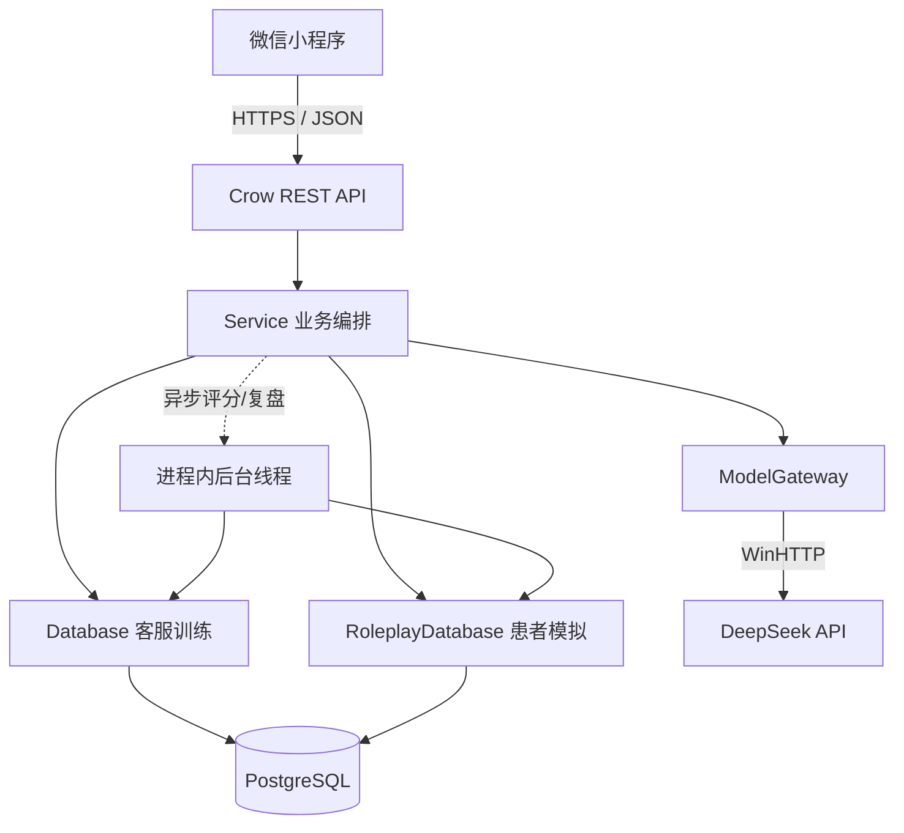

# 口腔客服智能陪练系统 - 后端构建方案

> 文档版本：v1.0
> 编写日期：2026-07-25
> 适用对象：后端开发、客户端开发、测试、运维、产品负责人
> 文档性质：基于当前仓库实现的现状说明与生产化演进方案

## 1. 文档目标

本项目已经具备一套可运行的后端 MVP，并非从零开始。当前实现使用 C++17、Crow、PostgreSQL 和 DeepSeek API，为微信小程序提供“客服训练”和“患者模拟”两条独立链路。本方案要回答三个问题：

1. 当前后端已经如何工作，哪些设计可以继续保留。
2. 从演示版走向可供诊所实际使用的系统，还缺少哪些能力。
3. 后续应按什么顺序建设，才能控制技术风险、医疗合规风险和交付成本。

本文以仓库中的 `backend/src/main.cpp`、数据库迁移、`docs/api.md` 和小程序请求封装为事实依据。文中的“当前实现”描述现有代码；“目标方案”与“演进建议”表示后续建设方向，不能与已上线能力混淆。

## 2. 结论先行

后端建议采用“先固化单体边界，再按压力拆分”的路线，而不是立即微服务化。

- MVP 阶段继续保留单体服务和 PostgreSQL，优先补齐身份认证、租户隔离、任务可靠性、可观测性和自动化测试。
- AI 不直接决定业务状态。会话状态、轮次、幂等、评分状态和数据权限由服务端与数据库控制，模型只生成受约束的内容。
- “客服训练”和“患者模拟”继续保持数据隔离。前者产生五维评分并进入管理看板，后者只产生标准答复与学习复盘，不进入评分统计。
- 模型调用统一收口到 Model Gateway，固定 Prompt 版本、输出 Schema、超时、重试、审计和安全兜底，避免页面或业务代码直接拼接模型请求。
- 生产环境必须由微信登录换取服务端身份，移除固定的 `demo-user-001`；所有业务数据至少按 `tenant_id + user_id` 隔离。
- 异步评分与复盘应从进程内 `detach` 线程升级为可恢复任务队列。这样服务重启后任务不会丢失，也能限制模型并发与成本。
- 第一阶段不需要拆库。PostgreSQL 继续作为唯一事实源，配合连接池、事务、索引、迁移版本和定期备份即可支撑早期业务。

## 3. 当前后端全景

### 3.1 技术栈与运行边界

| 层次 | 当前选择 | 作用 | 当前边界 |
|---|---|---|---|
| 客户端 | 微信小程序 | 场景选择、对话、结果、历史、数据页 | 开发环境默认访问 `127.0.0.1:8080/api` |
| HTTP 服务 | C++17 + Crow 1.2.1 | REST 路由、参数解析、统一响应 | 业务主要集中在单个 `main.cpp` |
| JSON | nlohmann/json 3.11.3 | API、Prompt 输入、模型输出、JSONB | 依靠运行时校验，未使用独立 Schema 库 |
| 数据访问 | libpqxx 7.10.1 | PostgreSQL 事务与参数化 SQL | 当前每次操作新建数据库连接 |
| 数据库 | PostgreSQL | 会话、消息、评分、复盘和场景配置 | 迁移脚本为 `001_initial.sql`、`002_roleplay.sql` |
| 模型网关 | WinHTTP + DeepSeek Chat Completions | 患者回复、评分、标准客服、复盘 | 当前依赖 Windows API，模型地址写在代码中 |
| 构建 | CMake + Visual Studio 2022 | 拉取依赖、编译、CTest | 当前发布目标主要是 Windows x64 |
| 测试 | PowerShell smoke + C++ validation | 接口冒烟、模型输出归一化与安全检查 | 尚无完整 CI 与数据库集成测试矩阵 |

### 3.2 逻辑架构



请求先进入 Crow 路由，由统一的 `handle` 包装器捕获业务异常、数据库异常和未知异常，再按 `{code, message, data}` 返回。路由层只做轻量参数读取，主要编排在 `Service`；数据访问分别位于 `Database` 与 `RoleplayDatabase`；所有 DeepSeek 调用集中在 `ModelGateway`。

这套分层虽然仍在一个源文件中，但职责已经出现清晰雏形，后续应按这些边界拆文件，而不必先改变运行形态。

### 3.3 两条业务链路

| 对比项 | 客服训练 | 患者模拟 |
|---|---|---|
| 学员扮演 | 客服 | 患者 |
| 模型扮演 | 虚拟患者 | 标准客服 |
| 核心产物 | 多轮对话、五维评分、违规与逐轮建议 | 标准答复、学习要点、合规边界、无分数复盘 |
| 数据表 | `sessions`、`messages`、`evaluations` | `roleplay_sessions`、`roleplay_messages`、`roleplay_summaries` |
| 是否进入看板 | 是 | 否 |
| 当前最大轮数 | 10 | 10 |
| 最少结束轮数 | 1 | 1 |

数据隔离是必须长期保留的产品规则。患者模拟用于观察标准服务表达，如果混入客服训练评分，会扭曲个人能力画像和团队统计。

## 4. 核心领域模型与数据设计

### 4.1 场景是训练的配置根

`scenarios` 保存公开信息、患者画像、训练重点、隐藏配置和患者模拟配置。公开字段可以返回客户端；以下内容只能留在服务端：

- 虚拟患者开场白之外的隐藏顾虑。
- 情绪、信任度、风险触发等内部状态规则。
- 用于标准客服生成的 `serviceGuidance`。
- 完整 Prompt、模型原始响应和密钥。

当前四个固定场景分别覆盖种植牙基础咨询、正畸基础咨询、诊所比价和术后不适咨询。生产化后可以增加场景版本、启停状态、适用门店、创建者、审核状态与发布时间，但训练会话必须引用一个不可变的场景版本，防止场景更新后历史报告无法复现。

建议新增：

| 字段 | 说明 |
|---|---|
| `tenant_id` | 所属机构或演示租户 |
| `scenario_version` | 场景内容版本 |
| `status` | `draft`、`published`、`archived` |
| `published_at` | 发布时间 |
| `created_by` / `updated_by` | 审核与变更追踪 |
| `content_hash` | Prompt 输入配置的稳定摘要，用于复现 |

### 4.2 会话是状态机，不是聊天记录集合

客服训练会话状态为 `in_progress -> completed` 或 `in_progress -> abandoned`。评分状态独立为 `not_started -> generating -> ready/failed`。患者模拟采用同样的会话状态，但复盘状态存放在 `roleplay_summaries`。

关键约束已经通过数据库体现：

- 同一用户、同一场景最多一个进行中会话。
- 轮次限制为 0 到 10。
- 消息长度限制为 1 到 1000。
- 评分或复盘与会话一对一。
- 删除会话时级联删除消息和产物。

生产化建议把状态转换集中在领域服务中，并为关键转换使用 `SELECT ... FOR UPDATE` 或条件更新，确保重复点击、网络重试和并发请求不会产生两份任务。

### 4.3 消息幂等

客户端为每条学员消息生成 `clientMessageId`。后端以 `(session_id, client_message_id)` 唯一约束保证幂等：

1. 首次请求先保存学员消息。
2. 调用模型前若请求失败，学员消息仍保留并成为 `pendingMessage`。
3. 客户端使用同一 ID 和相同内容重试。
4. 如果患者或标准客服回复已经生成，后端直接返回已有结果，不重复计轮次或调用模型。

这一设计应保留。生产阶段还应记录 `request_id`、模型调用 ID、尝试次数和延迟，便于定位“消息已落库但模型未返回”等中间状态。

### 4.4 建议的生产数据域

| 数据域 | 主要对象 | 建设目的 |
|---|---|---|
| 身份与组织 | tenants、users、memberships、roles | 微信身份、机构隔离、主管权限 |
| 内容配置 | scenarios、scenario_versions、prompt_templates | 场景发布、Prompt 版本和审核 |
| 训练业务 | sessions、messages、evaluations | 客服训练事实数据 |
| 患者模拟 | roleplay_sessions、roleplay_messages、roleplay_summaries | 独立学习链路 |
| AI 任务 | ai_jobs、ai_attempts | 可靠异步执行、重试、成本与审计 |
| 审计运营 | audit_logs、usage_daily | 敏感操作、用量、模型成本 |

早期仍可共用一个 PostgreSQL 实例和一个数据库，通过外键与索引保持一致性；只有当容量、合规或团队边界明确要求时再拆库。

## 5. API 构建思路

### 5.1 接口风格

当前 API 使用 `/api` 前缀、JSON 请求体和统一响应：

```json
{
  "code": 0,
  "message": "ok",
  "data": {}
}
```

建议生产化时升级为 `/api/v1`，保留业务错误码，并增加：

- `X-Request-Id`：链路追踪与问题定位。
- `Authorization` 或服务端会话 Cookie：替换演示用户头。
- 统一分页游标：历史记录增长后避免深分页。
- 明确的 API 兼容策略：新增字段向后兼容，破坏性变化升版本。
- OpenAPI 文档：由契约驱动接口测试和客户端类型生成。

### 5.2 当前接口分组

| 分组 | 主要接口 | 说明 |
|---|---|---|
| 健康与配置 | `GET /health`、`POST /config/deepseek-key` | 后者只能用于本地演示 |
| 场景 | `GET /scenarios`、`GET /roleplay/scenarios` | 隐藏配置不得下发 |
| 客服训练 | `POST/GET /sessions`、消息、结束、重开 | 完整训练生命周期 |
| 评分 | 获取评分、失败重试 | 结束训练后异步生成 |
| 患者模拟 | `POST/GET /roleplay/sessions`、消息、结束、重开 | 独立会话生命周期 |
| 学习复盘 | 获取复盘、失败重试 | 不产生分数 |
| 看板 | `GET /dashboard/summary` | 只统计客服训练 |

### 5.3 身份认证与权限

当前客户端固定发送 `X-Demo-User-Id: demo-user-001`，服务端实际上也使用固定常量。这只能用于单用户演示。生产流程应为：

1. 小程序调用 `wx.login` 获取一次性 `code`。
2. 客户端将 `code` 发送到 `POST /api/v1/auth/wechat`。
3. 后端通过微信服务端接口换取 `openid`/`unionid`，映射内部用户。
4. 后端签发短期访问令牌和可轮换的会话凭证。
5. 每个请求由认证中间件注入 `tenant_id`、`user_id` 和角色。
6. 数据查询永远把租户与用户条件写入 SQL，主管接口再依据角色扩大可见范围。

角色至少包括学员、主管、机构管理员和平台管理员。主管可以查看本机构汇总，但不能读取其他机构或无关员工的完整对话。高敏感操作需要审计日志。

### 5.4 限流与防滥用

限流应分三层：

- 用户层：限制单位时间发送消息和生成报告次数。
- 租户层：限制机构每日模型额度与并发。
- 模型层：对 DeepSeek 429、超时和熔断进行统一处理。

消息接口还需校验会话归属、状态、轮次、内容长度和相同幂等 ID 的内容一致性。不要只依赖前端按钮禁用。

## 6. AI 能力构建思路

### 6.1 Model Gateway 的职责

Model Gateway 是业务系统与模型供应商之间的隔离层，应承担：

- 模型供应商与版本选择。
- Prompt 模板加载、变量注入和版本标记。
- 超时、有限重试、退避、并发限制和熔断。
- JSON 输出约束、解析、归一化和业务级安全校验。
- Token、时延、错误和费用记录。
- 敏感信息清理与日志脱敏。
- 可替换供应商适配，避免业务代码依赖 DeepSeek 特有字段。

当前代码已实现集中调用、20 秒接收超时、结构化 JSON 优先、去除 `<think>`、代码块恢复、嵌套 JSON 字符串恢复和部分失败重试，是正确的 MVP 起点。

### 6.2 四类模型任务

| 任务 | 输入 | 输出 | 温度倾向 | 主要风险 |
|---|---|---|---|---|
| 虚拟患者回复 | 场景、内部状态、对话历史 | 回复、情绪、信任度、新披露信息、结束标记 | 中等 | 泄露 Prompt、越位诊断、角色漂移 |
| 客服训练评分 | 场景、完整对话 | 五维分、总结、优势、改进、违规、逐轮点评 | 低 | 编造引用、评分漂移、医学建议 |
| 标准客服答复 | 场景指导、患者提问历史 | 答复、学习要点、合规边界、结束标记 | 中低 | 承诺疗效、编造价格或政策 |
| 患者模拟复盘 | 场景、完整练习 | 总结、覆盖主题、关键原则、下次建议 | 低 | 把无分数学习误写为评分 |

### 6.3 输出可信链

模型输出不能直接写库或返回。建议固定以下流水线：

1. 传输层校验：HTTP 状态、响应大小、超时。
2. 语法层校验：提取合法 JSON 对象。
3. Schema 校验：字段类型、枚举、长度、数组数量、分数范围。
4. 事实锚定：报告中的学员原话必须能在对应轮次逐字找到。
5. 医疗合规校验：拦截诊断、药物、治疗指令、绝对保证、虚构价格与机构政策。
6. 归一化：分数截断、默认值和安全回退表达。
7. 持久化：保存规范化结果、模型版本、Prompt 版本和生成时间。

仓库中的 `normalizeReport`、`normalizeRoleplayReply` 与验证测试已经覆盖若干关键规则，后续应把规则拆成可配置、可单测的安全模块，并积累回归样本集。

### 6.4 Prompt 管理

Prompt 不应长期硬编码在业务源文件。建议建立 `prompt_templates` 或版本化资源文件，至少记录：

- `task_type`、`version`、`status`。
- system/user 模板与输出 Schema。
- 适用模型、最大 Token、温度。
- 发布人、审核人、发布时间和变更说明。
- 回归评测结果与安全阈值。

每份评分和复盘保存 `model_version + prompt_version + scenario_version`，这样才能解释历史结果、回滚异常版本并进行 A/B 对比。

## 7. 关键业务流程

### 7.1 客服训练消息流程

1. 客户端创建或恢复会话。
2. 客户端生成稳定的 `clientMessageId` 并提交客服话术。
3. 后端事务校验会话归属与状态，保存学员消息或读取已有消息。
4. 后端读取场景隐藏配置、患者内部状态和完整历史。
5. Model Gateway 生成并校验虚拟患者回复。
6. 后端事务保存患者回复、更新患者状态和轮次。
7. 到达最大轮次时，原子结束会话并创建评分任务。
8. 客户端收到本轮结果；若模型失败，则按 `pendingMessage` 使用相同 ID 重试。

同步模型调用会让单轮体验更直接，但必须设置总超时与并发上限。若未来模型时延明显上升，可以把消息生成也异步化，并通过短轮询或 WebSocket/SSE 推送结果。

### 7.2 结束与评分流程

1. `POST /sessions/{id}/finish` 锁定会话并验证至少一轮。
2. 会话立即变为 `completed`，评分状态变为 `generating`。
3. 服务创建唯一评分任务并返回 HTTP 202。
4. Worker 读取场景版本与完整对话，调用评分模型。
5. 输出通过 Schema、引用与安全检查后写入 `evaluations`。
6. Worker 原子更新 `sessions.total_score` 和 `evaluation_status=ready`。
7. 客户端轮询评分；失败时可显式创建重试任务。

当前 MVP 使用 `std::thread(...).detach()` 执行第 4 到第 6 步。目标实现应使用数据库任务表或消息队列：任务必须有唯一键、租约、重试次数、下次执行时间和死信状态，服务重启后能继续执行。

### 7.3 患者模拟流程

患者模拟与客服训练类似，但没有患者开场白和分数。学员先以患者身份提问，模型返回标准客服答复、学习要点和合规边界。结束后生成无分数复盘。看板 SQL 必须只查询客服训练表，确保统计口径稳定。

## 8. 可靠性、一致性与并发

### 8.1 事务边界

需要在一个事务中完成的操作包括：

- 放弃旧会话并创建同场景新会话。
- 保存模型回复、更新轮次和内部状态。
- 结束会话并创建唯一评分/复盘任务。
- 保存最终报告并更新会话摘要分数。

模型网络调用不应占用数据库事务。正确顺序是“短事务保存请求 -> 事务外调用模型 -> 短事务幂等保存结果”。

### 8.2 任务队列的最小实现

早期可以先用 PostgreSQL 实现可靠任务表，无需立刻引入额外中间件：

| 字段 | 用途 |
|---|---|
| `id` / `job_type` | 任务标识与类型 |
| `dedupe_key` | 如 `evaluation:{sessionId}`，防止重复任务 |
| `status` | pending、running、succeeded、retry_wait、dead |
| `attempts` / `max_attempts` | 控制有限重试 |
| `available_at` | 退避后的下次执行时间 |
| `lease_until` / `worker_id` | Worker 崩溃后的任务回收 |
| `payload` | 会话 ID、版本等最小输入 |
| `last_error` | 脱敏后的失败类型 |

Worker 使用 `FOR UPDATE SKIP LOCKED` 领取任务。后续只有当吞吐或跨服务需求上升时，再迁移到 Redis Streams、RabbitMQ 或云队列。

### 8.3 数据库连接

当前每个数据库方法创建一个 `pqxx::connection`，简单但会在并发增长时产生握手和连接数压力。下一阶段应引入有上限的连接池，并分别设置 API 与 Worker 池，防止耗时任务挤占在线请求连接。

## 9. 安全与医疗合规

### 9.1 数据最小化

产品应持续提示用户不要输入真实姓名、电话、病历等隐私信息。服务端仍要假设用户可能误输，并采取：

- 输入前置提示与基础敏感信息识别。
- 日志不记录完整对话、Token、数据库连接串和模型密钥。
- 对话按明确期限保留，支持机构级删除与导出流程。
- 备份加密、传输 HTTPS、数据库最小权限。
- 生产密钥由 Secret Manager 或受控环境变量提供，不允许页面上传模型密钥。

### 9.2 医疗边界

后端必须阻止模型输出以下内容：

- 对用户具体情况作出诊断或治疗方案判断。
- 推荐具体药物、剂量、操作或治疗手段。
- 承诺疗效、成功率、无痛、绝对安全或确定恢复时间。
- 编造价格、优惠、材料或机构政策。
- 在术后风险场景中淡化明显异常，或阻止联系医生。

安全回退文本应说明客服只能提供信息收集、预约或复诊协助，具体情况由医生结合检查评估。高风险样本应进入人工复核和回归测试集。

### 9.3 常规应用安全

- 所有 SQL 使用参数化查询；动态筛选只允许白名单值。
- 生产 CORS 不使用 `*`，仅允许实际小程序/管理端来源策略。
- 反向代理限制请求体、连接数和超时。
- 返回给客户端的错误不包含 SQL、Prompt 或模型原文。
- 管理端需要 RBAC、操作审计和敏感字段遮蔽。
- 依赖版本定期扫描，构建产物生成 SBOM 与校验值。

## 10. 部署架构

### 10.1 开发与演示环境

当前 Windows 免编译包适合本地演示：后端、微信开发者工具和 PostgreSQL 可运行在同一台机器。该模式强调易用，不代表生产架构。

### 10.2 建议的生产拓扑

```text
微信小程序
    |
    | HTTPS
    v
WAF / API Gateway / Nginx
    |
    +--> API 实例 x N --------> PostgreSQL 主库
    |          |                    |
    |          +--> AI 任务表 <-----+
    |
    +--> Worker 实例 x N -----> DeepSeek API
               |
               +-------------> 指标、日志、告警
```

API 服务保持无状态，可水平扩容；Worker 单独限制模型并发。数据库放在私网，公网只开放 443。健康检查至少区分进程存活、数据库就绪和模型配置状态，模型供应商短暂异常不应让负载均衡立即摘除所有 API 实例。

### 10.3 配置分层

| 类别 | 示例 | 管理方式 |
|---|---|---|
| 普通配置 | 端口、日志级别、超时、并发 | 环境变量或配置中心 |
| 秘密 | 数据库密码、DeepSeek Key、微信密钥 | Secret Manager |
| 业务配置 | 场景、Prompt、评分权重 | 数据库版本化与审核 |
| 客户端配置 | 各环境 API 地址 | 小程序环境配置，正式环境仅 HTTPS |

## 11. 可观测性与运营指标

### 11.1 技术指标

- API 请求量、P50/P95/P99 延迟和错误率。
- PostgreSQL 连接池占用、慢查询、事务冲突和存储增长。
- 模型调用成功率、首字节/总耗时、429、超时、解析失败率。
- AI 任务排队长度、等待时间、重试率和死信数。
- 每类 Prompt 的 Token 与费用。

### 11.2 产品与质量指标

- 创建会话到完成首轮的转化率。
- 平均训练轮次、完成率、重练率。
- 评分生成成功率和等待时间。
- 各场景训练次数与五维分布。
- 安全回退触发率、违规类型分布和人工复核命中率。
- 患者模拟复盘完成率，但不与客服评分混合。

日志统一携带 `request_id`、`tenant_id`、脱敏后的 `user_id`、`session_id`、`job_id`、`model_version` 和 `prompt_version`。不要记录密钥、完整认证凭证或未经脱敏的用户输入。

## 12. 测试策略

### 12.1 当前基础

仓库已有两类测试：

- `backend/tests/smoke.ps1`：验证健康、场景、看板、两条完整业务链路和消息幂等。
- `backend/tests/report_validation_test.cpp`：验证模型 JSON 恢复、字段归一化、报告引用锚定和不安全建议回退。

### 12.2 建议测试金字塔

| 层次 | 重点 |
|---|---|
| 单元测试 | 状态机、分数计算、输出 Schema、安全规则、Prompt 组装 |
| 数据库集成测试 | 迁移、唯一约束、事务回滚、并发重试、租户隔离 |
| API 契约测试 | 状态码、错误码、响应字段、权限与分页 |
| 模型回归测试 | 固定样本的结构通过率、引用真实性、医疗边界、评分稳定性 |
| 端到端测试 | 小程序开始、续练、重开、结束、报告、历史与两种模式隔离 |
| 压力与故障测试 | 模型超时、429、数据库短暂不可用、Worker 重启、重复请求 |

CI 至少执行格式检查、CMake 构建、CTest、数据库迁移和无模型冒烟测试。需要真实模型的测试可设为受控的定时任务，避免每次提交都产生费用和不稳定结果。

## 13. 代码组织演进

当前单文件实现便于 MVP 快速交付，但后续建议按现有职责拆分：

```text
backend/
  src/
    main.cpp
    config/
    http/
      routes/
      middleware/
      response.cpp
    domain/
      training/
      roleplay/
      scenario/
    application/
      training_service.cpp
      roleplay_service.cpp
    infrastructure/
      postgres/
      model/
      jobs/
      observability/
  migrations/
  tests/
    unit/
    integration/
    contract/
```

拆分目标是提高可测试性和边界清晰度，不是为了文件数量。领域层不依赖 Crow、WinHTTP 或具体 SQL；基础设施实现接口；路由只负责协议转换。

## 14. 分阶段实施路线图

### 阶段 0：冻结现状与建立基线（1 周）

- 固化 API 契约、数据库迁移顺序和四类 Prompt 版本。
- 为现有核心流程补齐无模型集成测试。
- 记录性能、模型成功率与成本基线。
- 建立开发、测试、生产配置清单。

验收：当前功能不回归；构建和核心测试可在 CI 重复运行。

### 阶段 1：生产可用基础（2-3 周）

- 微信登录、用户、机构和角色模型。
- 全部 SQL 加租户与用户隔离。
- HTTPS 反向代理、Secret 管理、生产 CORS。
- 数据库连接池、结构化日志、请求 ID、基础指标和告警。
- Prompt 从源文件抽离并版本化。

验收：两个机构间数据不可互见；密钥不进入客户端、日志或仓库；关键接口可追踪。

### 阶段 2：可靠 AI 任务（2 周）

- 建立 `ai_jobs`/`ai_attempts` 和 Worker。
- 评分、复盘改为可恢复任务，支持退避、死信和人工重试。
- 模型并发、租户额度和费用统计。
- 供应商适配接口与安全回退统一化。

验收：API 或 Worker 重启不会丢评分任务；重复结束请求只产生一个有效报告。

### 阶段 3：质量与运营（2-4 周）

- 场景与 Prompt 发布审核。
- 模型回归集、合规红队样本和质量看板。
- 主管端权限、团队汇总、数据保留与审计。
- 备份恢复演练、容量与故障演练。

验收：Prompt 变更可审核、可回滚、可比较；高风险输出有明确处置链路。

### 阶段 4：按真实瓶颈扩展（持续）

只有出现明确瓶颈后才考虑：独立队列、读副本、缓存、对象存储、多供应商路由或服务拆分。拆分依据应是吞吐、故障域、合规和团队所有权，而不是架构形式本身。

## 15. 关键风险与应对

| 风险 | 影响 | 主要应对 |
|---|---|---|
| 模型输出越权或不稳定 | 医疗合规与用户信任 | Schema + 规则校验 + 安全回退 + 回归集 + 人工复核 |
| 固定演示用户进入生产 | 严重数据越权 | 微信登录、租户隔离、RBAC、权限集成测试 |
| 进程重启丢异步任务 | 报告长期停留 generating | 持久化任务、租约、重试与恢复扫描 |
| 并发导致重复消息或报告 | 费用增加、数据冲突 | 幂等键、唯一约束、事务与条件更新 |
| 数据库连接耗尽 | API 不可用 | 连接池、并发上限、API/Worker 连接隔离 |
| Prompt 变更不可追溯 | 历史评分无法解释 | 版本、发布审核、模型与场景版本一并落库 |
| 隐私数据进入日志或模型 | 合规风险 | 最小化、脱敏、保留策略、权限与供应商协议 |
| Windows 专用实现限制部署 | 云端运维成本 | 抽象 HTTP Client，提供跨平台实现或容器化构建 |

## 16. 生产上线验收清单

- [ ] 小程序正式环境只访问备案并配置合法域名的 HTTPS API。
- [ ] 已移除生产环境运行时上传 DeepSeek Key 的能力。
- [ ] 微信身份、租户和角色权限已经端到端生效。
- [ ] 所有会话、历史、看板和管理查询均通过租户隔离测试。
- [ ] 消息重试、重复结束、Worker 重启和模型超时均有验证记录。
- [ ] Prompt、模型、场景版本可从任一报告追溯。
- [ ] 医疗合规样本集与安全回退测试通过。
- [ ] 日志、指标、告警、备份和恢复演练完成。
- [ ] 数据保留、删除、导出和审计流程经过确认。
- [ ] 发布包不包含密钥、本地配置、构建缓存或真实训练数据。

## 17. 最终建议

这个项目后端的核心不是“把聊天接口接上模型”，而是建立一个可控的训练状态机：业务系统掌握身份、状态、幂等、数据和权限，模型只在受约束的任务中生成内容。当前 MVP 已经验证了两条训练链路、PostgreSQL 落库、DeepSeek 结构化输出和基础安全归一化，下一步最有价值的投入是把这些能力变得可恢复、可追踪、可隔离、可审计。

建议先完成生产可用基础与可靠 AI 任务，再依据真实用户量决定是否拆服务。这样既保留现有 C++ MVP 的交付成果，也避免在身份、合规和任务可靠性尚未解决时提前承担分布式系统复杂度。

## 附录 A：当前仓库事实来源

- `backend/src/main.cpp`：HTTP 路由、数据访问、模型网关、输出归一化和业务编排。
- `backend/migrations/001_initial.sql`：客服训练表结构与四个固定场景。
- `backend/migrations/002_roleplay.sql`：患者模拟表结构与场景指导。
- `backend/CMakeLists.txt`：C++17、Crow、nlohmann/json、libpqxx、WinHTTP 构建配置。
- `backend/tests/smoke.ps1`：基础接口与真实模型流程冒烟测试。
- `backend/tests/report_validation_test.cpp`：报告与安全归一化测试。
- `docs/api.md`：MVP API 契约。
- `utils/api.js`、`utils/config.js`：小程序请求封装与环境地址选择。

## 附录 B：建议优先建立的架构决策记录

1. ADR-001：继续采用模块化单体，何时触发服务拆分。
2. ADR-002：微信身份、租户边界和角色模型。
3. ADR-003：PostgreSQL 任务队列与任务幂等策略。
4. ADR-004：模型供应商适配与 Prompt 版本管理。
5. ADR-005：训练数据保留、删除与审计策略。
6. ADR-006：医疗合规输出规则与人工复核机制。
